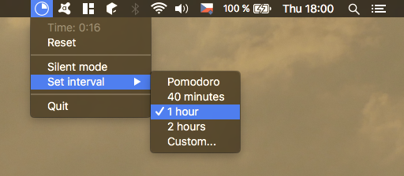

Computer Time
=============

A macOS app to measure time you spend in front of computer screen.

Features:

- shows current computer time in menu bar ("pie clock" icon)
- notifies you when it's time to take a break (after 1 hour by default)
- resets when you take a break (at least 3 minutes in screensaver or computer sleep)

Dependencies:

- python3
- rumps
- reportlab (to generate PDF icons)

Prepare data (icons):

    make data

Create App:

    python3 setup.py py2app

Development
-----------

Run in alias mode:

    python3 setup.py py2app -A
    ./dist/computer-time.app/Contents/MacOS/computer-time

References:
- Screensaver notifications:
[Stack Overflow 1419531](http://stackoverflow.com/questions/1419531/mac-screensaver-start-event/1561512#1561512)
- Sleep and wake notifications:
[Apple Technical Q&A QA1340](https://developer.apple.com/library/mac/qa/qa1340/_index.html)
